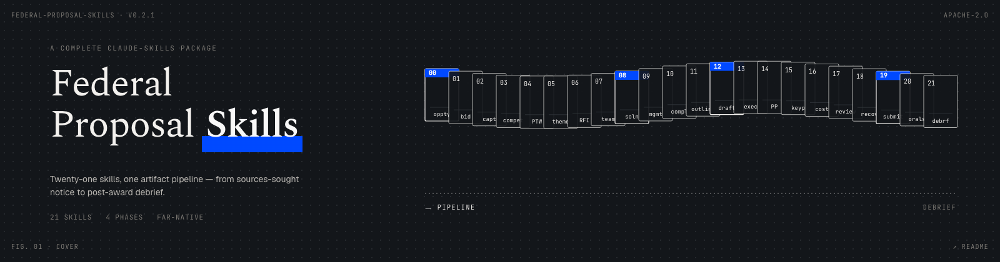
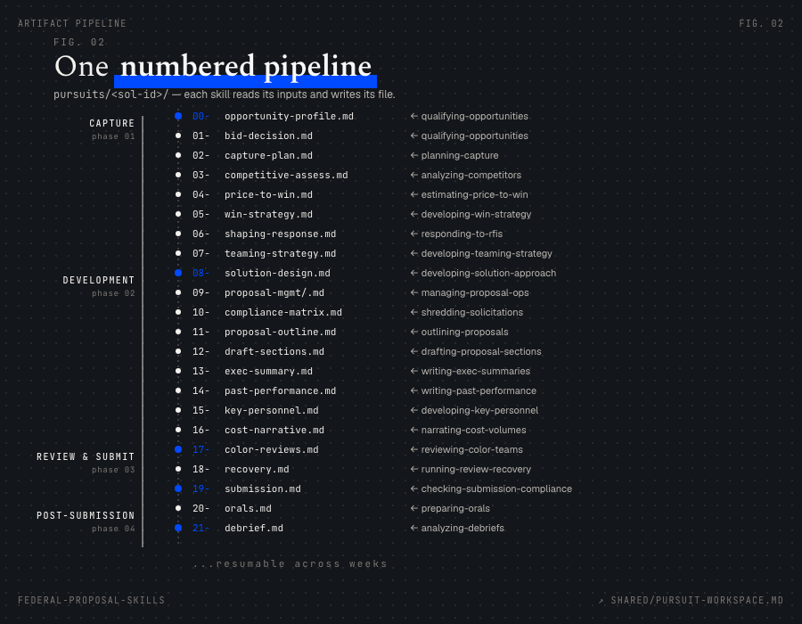

<p align="center"></p>

# Federal Proposal Skills

A complete set of [Claude Skills](https://platform.claude.com/docs/en/agents-and-tools/agent-skills/overview) for the **US Federal capture and proposal lifecycle**, from the first sources-sought notice to the post-award debrief.

Most published proposal skills stop at "shred the RFP and draft some sections." That covers the mechanical middle of the job and skips the parts that decide wins: bid/no-bid discipline, capture planning, price-to-win, win-theme development, evaluator-perspective reviews, and submission compliance. This package covers the **whole lifecycle**, and it is built specifically for federal procurements governed by the FAR: Sections L and M, the Uniform Contract Format, color team reviews, FAR Part 15 source selection, and IDIQ/task-order fair opportunity.

> **Status: v0.2.1.** All twenty-one lifecycle skills are complete, with reference files, templates, and evaluation scenarios. See [CHANGELOG.md](CHANGELOG.md). The package has not yet been exercised on real solicitations end to end; treat v0.2.1 as ready for review and field testing.

## Why this exists

Federal business development runs on a disciplined, gated lifecycle (the model most shops call the *Shipley* process). Each gate produces specific artifacts, and each artifact feeds the next. An AI that helps with one step but ignores the chain produces a compliant proposal that loses. These skills mirror the real lifecycle: they hand structured artifacts down a pipeline so work done during capture is still load-bearing on the day the proposal ships.

## The lifecycle and the skills

Skills are grouped by lifecycle phase. Each one runs on its own; they are also designed to chain through a shared [pursuit workspace](shared/pursuit-workspace.md).

### Phase 1: Capture (pre-RFP)

| Skill | What it does |
|---|---|
| ✅ `qualifying-opportunities` | Runs a structured bid/no-bid gate review and produces a defensible scorecard and recommendation. |
| ✅ `planning-capture` | Builds and maintains a living capture plan: customer, requirement, competitive position, teaming, win strategy, action items. |
| ✅ `analyzing-competitors` | Black Hat competitive assessment that models each likely competitor's solution, price posture, and themes, and derives counters. |
| ✅ `estimating-price-to-win` | Structured price-to-win analysis: competitive price range, cost drivers, and a target the bid must hit to win. |
| ✅ `developing-win-strategy` | Converts customer hot buttons and discriminators into substantiated win themes and ghosting language. |
| ✅ `responding-to-rfis` | Drafts pre-RFP shaping responses: sources-sought, RFI, draft-RFP comments, white papers, capability statements. |
| ✅ `developing-teaming-strategy` | Gap analysis, partner scoring, workshare, teaming agreements, subcontractor data calls, OCI screening. |

### Phase 2: Proposal development

| Skill | What it does |
|---|---|
| ✅ `developing-solution-approach` | Designs the proposal-ready solution (technical, staffing, transition, management, risk, quality) against requirements, win themes, and cost. |
| ✅ `managing-proposal-operations` | Runs the proposal as a project: schedule, assignments/RACI, action register, question log, amendment control, review logistics. |
| ✅ `shredding-solicitations` | Shreds the solicitation into a requirements/compliance matrix with a Section L ↔ M ↔ SOW/PWS cross-walk. |
| ✅ `outlining-proposals` | Builds a compliant annotated outline and storyboards: theme statements, proof points, graphics concepts per section. |
| ✅ `drafting-proposal-sections` | Drafts section narrative from storyboards: customer-focused, benefit-led, traceable to requirements. |
| ✅ `writing-executive-summaries` | Writes the executive summary as a persuasion document organized around win themes and customer hot buttons. |
| ✅ `writing-past-performance` | Builds past performance write-ups tailored to the solicitation's recency, relevancy, and scope criteria. |
| ✅ `developing-key-personnel` | Tailors key-personnel resumes and staffing approach to Section L format and Section M evaluation criteria. |
| ✅ `narrating-cost-volumes` | Drafts the cost/price volume narrative and basis-of-estimate (BOE) text; checks cost-technical consistency. |

### Phase 3: Review and submission

| Skill | What it does |
|---|---|
| ✅ `reviewing-color-teams` | Runs Blue, Pink, Green, Red, Gold, and White Glove reviews, including a Red Team that scores the draft as a source-selection evaluator would. |
| ✅ `running-review-recovery` | Turns color team findings into assigned, completed, and verified corrections; produces a recovery burn-down. |
| ✅ `checking-submission-compliance` | Final production check: page limits, format rules, required forms/reps/certs, file-naming, portal mechanics. |

### Phase 4: Post-submission

| Skill | What it does |
|---|---|
| ✅ `preparing-orals` | Builds an orals presentation from the written proposal and rehearses likely evaluator questions. |
| ✅ `analyzing-debriefs` | Prepares debrief questions, analyzes the government's debrief, and produces win/loss lessons learned. |

## How the skills work together

The skills share a **pursuit workspace**: one directory per opportunity holding numbered artifact files. Each skill reads what it needs and writes its own. The numbering keeps the pipeline legible and lets you resume a multi-week pursuit without re-explaining context. See [shared/pursuit-workspace.md](shared/pursuit-workspace.md) for the full convention.

<p align="center"></p>

```
pursuits/<solicitation-id>/
  00-opportunity-profile.md      ← qualifying-opportunities
  01-bid-decision.md             ← qualifying-opportunities
  02-capture-plan.md             ← planning-capture
  03-competitive-assessment.md   ← analyzing-competitors
  04-price-to-win.md             ← estimating-price-to-win
  05-win-strategy.md             ← developing-win-strategy
  06-shaping-response-<type>.md  ← responding-to-rfis
  07-teaming-strategy.md         ← developing-teaming-strategy
  08-solution-design.md          ← developing-solution-approach
  09-proposal-management/        ← managing-proposal-operations
  10-compliance-matrix.md        ← shredding-solicitations
  11-proposal-outline.md         ← outlining-proposals
  ...
```

## Install

This package targets two distinct surfaces. Pick the one that matches your tool.

### Claude Code (CLI) — full plugin install

In a Claude Code session, run these two commands one at a time (wait for the marketplace add to confirm before running install):

```
/plugin marketplace add https://github.com/danielkinneyspears/federal-proposal-skills.git
```

```
/plugin install federal-proposal-skills@federal-proposal-skills
```

Note the explicit `https://` URL with the `.git` suffix. Claude Code's `owner/repo` shorthand defaults to SSH, which fails on machines without GitHub SSH keys configured. The full HTTPS URL avoids that.

To verify or troubleshoot:

```
/plugin marketplace list        # confirm the marketplace was added
/plugin                          # browse Discover tab; UI install
/reload-plugins                  # activate after install
```

### Claude.ai (web) and the Claude desktop app — per-skill zip upload

Claude.ai and the Claude desktop app do **not** have the plugin-marketplace concept. They support uploading individual skills as zip files. Build a self-contained zip with the shared references inlined, then upload via Settings → Capabilities → Skills:

```
scripts/package-skill.sh shredding-solicitations
```

This writes `dist/shredding-solicitations.zip` with `shared/` bundled inside the skill and the `../../shared/` paths rewritten. To package every skill at once, run `scripts/package-skill.sh --all`. Same zips work for the [Skills API](https://platform.claude.com/docs/en/build-with-claude/skills-guide).

## Sibling package: `govcon-pursuit-brain` (optional)

This package handles the pursuit lifecycle as a flat-artifact pipeline. A sibling package, [`govcon-pursuit-brain`](https://github.com/danielkinneyspears/govcon-pursuit-brain), handles the same lifecycle as a wiki-native knowledge graph, and additionally ships a comprehensive federal-acquisition domain wiki (Obsidian-compatible: FAR/CFR orientation, set-asides, vehicles, source selection, security and compliance, AI procurement memos, capture and proposal craft).

The sibling is completely optional. If your team already has a knowledge base, wiki, or brain for federal acquisition, use it. This package works with whatever domain context you already have; nothing here requires the sibling. If you do not have one, the sibling's `knowledge/` directory is a ready starter pack you can drop in alongside this package and build on. Per-pursuit memory and "company context" patterns are documented there too.

Both packages are Apache 2.0, both stand alone, and both are launched together so users can pick the model that fits their workflow.

## Design principles

Every skill in this package follows five rules, drawn from [Anthropic's skill-authoring best practices](https://platform.claude.com/docs/en/agents-and-tools/agent-skills/best-practices) and the realities of proposal work:

1. **Enforce the process.** Federal proposals fail when steps are skipped. Each skill runs an explicit, checklist-driven workflow rather than one-shotting an answer.
2. **Encode the standard once.** FAR structure, color team definitions, evaluation mechanics, and format conventions live in [`shared/`](shared/) and the skill reference files, not re-explained every session.
3. **Interrogate before generating.** Each skill opens with a short, numbered intake that surfaces the facts a real proposal manager would demand before starting.
4. **Persist to disk.** Skills read and write artifacts in the pursuit workspace, so a pursuit survives across many sessions and many weeks.
5. **Close the loop.** Skills that produce judgment-heavy output (compliance matrices, color reviews, price-to-win) include a validation pass against an explicit standard before finishing.

## Important limits, read before use

- This is decision support, not a decision. Bid/no-bid, pricing, and win-strategy outputs are structured analyses to inform human judgment. A capture manager owns the call.
- Not legal or contracts advice. The skills reference the FAR for structure and vocabulary. They do not substitute for your contracts, legal, or compliance review.
- Protect sensitive information. Do not place classified, controlled unclassified information (CUI), source-selection-sensitive material, or competitor proprietary data into a pursuit workspace or any model context unless your organization's policy and the applicable safeguarding rules permit it. The `pursuits/` directory is git-ignored by default for this reason.
- The customer's solicitation governs. Where this package's conventions differ from a specific solicitation's Section L instructions, Section L wins. Always.
- Verify current regulations. The package describes durable acquisition structures, but the FAR, agency supplements, dollar thresholds, and deadlines change. For any deadline-sensitive or legally adjacent task (debrief windows, late-proposal rules, size standards, protest timelines), confirm the current FAR section, the applicable agency supplement, and the actual solicitation text before relying on package defaults.

## Contributing

Federal BD practitioners: corrections and additions are welcome, especially agency-specific or vehicle-specific patterns. See [CONTRIBUTING.md](CONTRIBUTING.md).

## License

Apache 2.0. See [LICENSE](LICENSE).
